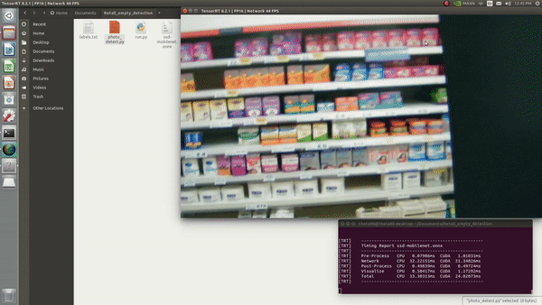
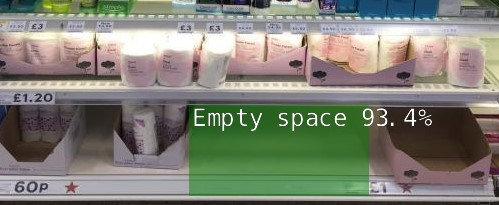
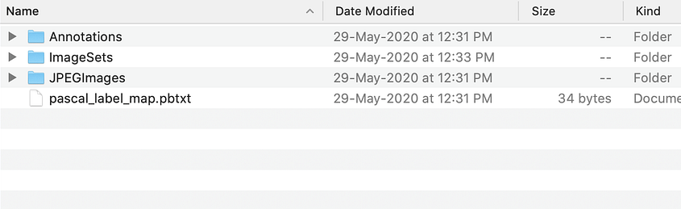
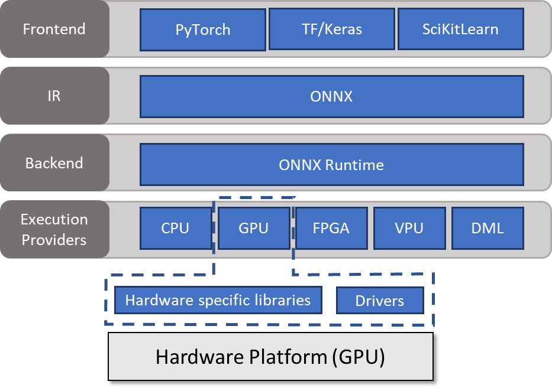

# Retail-Empty-shelf-detection

The system is able to monitor and detect the empty space on shelf within the camera vision. Each empty space detected will and a green bounding box will be drawn on it. 

There is also a calibration process to define the ground surface mapping from the camera view. The calibration input will be set by the user.




## Requirements

- NVIDIA Jetson Platform.
- [JetPack](https://developer.nvidia.com/embedded/jetpack) 4.6.1 or above.
- USB webcam [ v4lt device ]
- TensorRT,OpenCV,CUDA.
  
#### Test on :

- Jetson nano,Jetson xavier NX, JetPack 4.6.1,USB webcam.

## Build Environment

```
// clone the repo
$ git clone --recursive https://www.github.com/dusty-nv/jetson-inference.git

$ cd jetson-inference

$ mkdir build && cd build

$ cmake ..
// Build the C++ libraries and Python bindings.
$ make
//install the libraries and link them.
$ sudo make install
$ sudo ldconfig
#if already compiled jetson-inference skip this section.
```

## Run Inference 
```
$ cd jetson-inference/
$ git clone https://github.com/arunachalamjs005/Retail-Empty-shelf-detection.git
$ sudo python3 run.py
```




# Training and Detection Steps 

## Dataset preprocessing
- Prepare dataset with Pascal voc format.
- [labelimg](https://github.com/HumanSignal/labelImg) tool for xml annotations.
- Create dataset below folder structure.



#### Labelimg Tool installation for annotation
```
$ git clone https://github.com/HumanSignal/labelImg.git
$ cd labelimg-master
$ sudo apt-get install pyqt5-dev-tools
$ sudo pip3 install lxml
$ make qt5py3
$ python3 labelImg.py  // application launch
```

- Annotation folder contain all annotaion files.
- Jpegimages folder contain all  image files.
- Imageset --> Main --> test,validation,train,trainval.
  
## Train with Mobilenet-v1-ssd model

```
$ cd jetson-inference/python/training/detection/ssd
$ apt-get install wget
$ wget https://nvidia.box.com/shared/static/djf5w54rjvpqocsiztzaandq1m3avr7c.pth -O models/mobilenet-v1-ssd-mp-0_675.pth
$ python3 train_ssd.py --data=datasetfolder --model-dir=models/output_folder --batch-size=2 --epochs=50
```
## onnx model conversion

```
$ cd jetson-inference/python/training/detection/ssd
$ python3 onnx_export.py --model-dir=models/Retail_model
```



## Run inference

```
$ detectnet --model=models/fruit/ssd-mobilenet.onnx --labels=models/fruit/labels.txt  --input-blob=input_0 --output-cvg=scores --output-bbox=boxes /dev/video0 (source)
```
